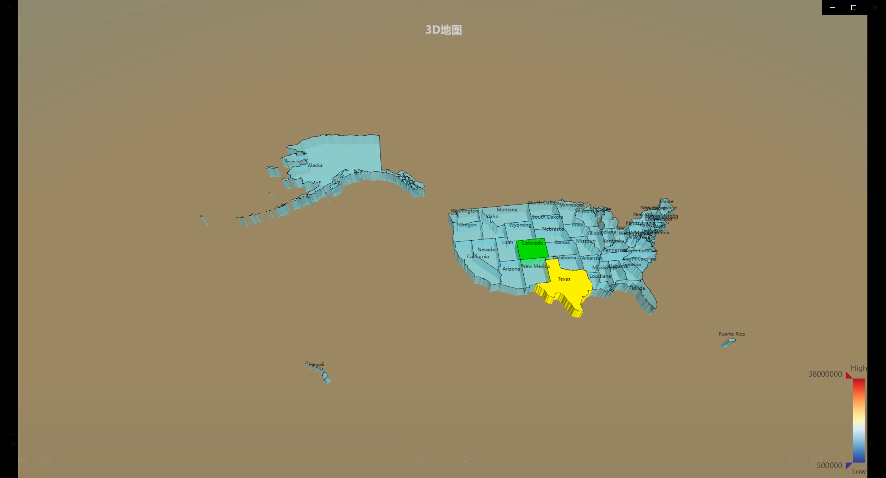
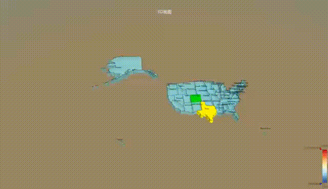

<h1 align="center"> ECharts3D地图</h1>

* 感谢 [ECharts3D地图(详细示例——附有具体注释)](https://blog.csdn.net/GRAY_KEY/article/details/81295961) 。

### 插件版本

```
echarts-gl 1.1.2
```
```
echarts 4.2.1
```

*
* 其中：MiddleTopMap1.vue文件通过最新echarts和echarts-gl采用map3D实现的效果。
### 如有错误，请指正

### 效果图



